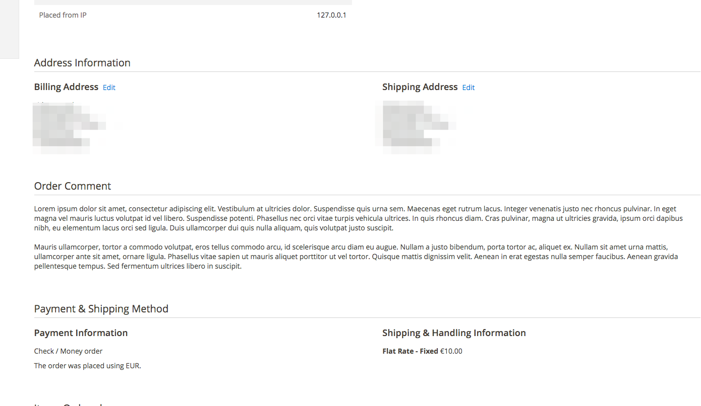

# ParamountVentures Commerce: Magento 2 Deliver Later

## Description
This extension allows customers to place a comment during the checkout.
The comment field is displayed in the billing step right above the place order button.

Store owners can then see these comments in the backend on the order grid and on the order view page.

### Checkout view


### Admin panel


## Installation
```
composer require "paramountventures/magento2-deliverlater":"~1.5.0"
php bin/magento module:enable ParamountVentures_DeliverLater
php bin/magento setup:upgrade
```

## Changelog

1.0.0
=============
initial version

## Technical
Custom implementation of Magento_Checkout/js/action/place-order.js to submit the order, this extension sends
the deliver later time in a separate request during the validation, before the order is placed.


## Uninstall
If you installed this module through composer, then you can run `php bin/magento module:uninstall ParamountVentures_DeliverLater` to automatically
remove the code and drop the columns added by this extension.

*note:* the uninstall command seems bugged and might get stuck at `Removing code from Magento codebase:` (It worked fine for me on a 2.1.0 install but not on a 2.1.4 install). When this happens you should
exit with `ctrl+c` and run 
```
composer update
php bin/magento maintenance:disable
```
See [github issue 3544](https://github.com/magento/magento2/issues/3544)

## License
MIT
